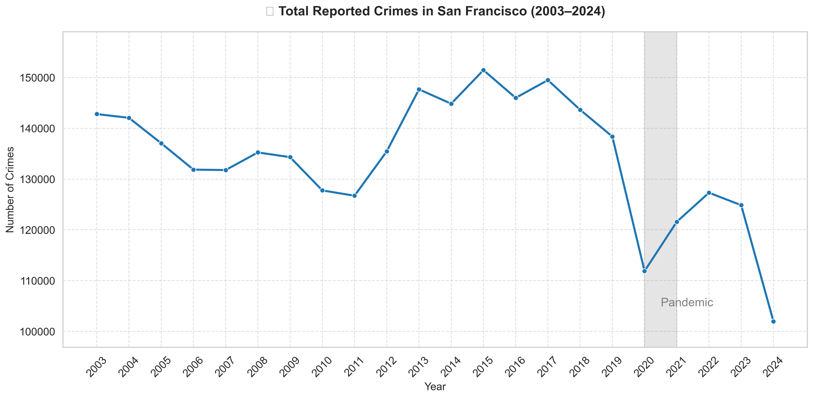
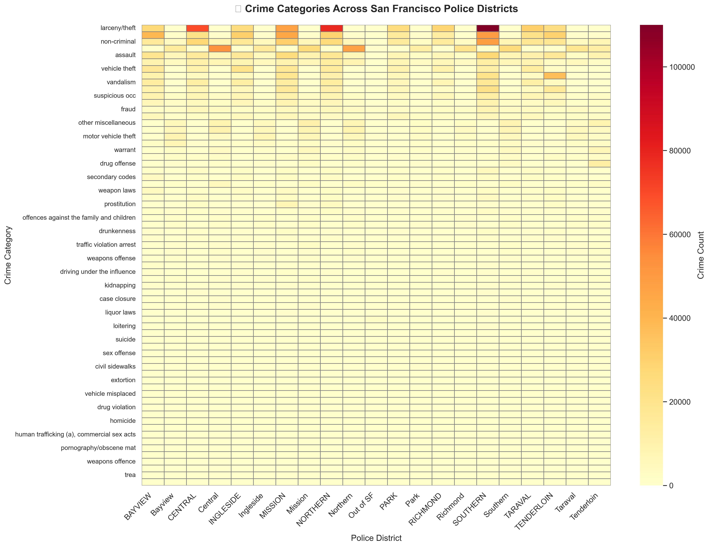

# Crime in San Francisco: A Decade in Data

*Social Data Analysis and Visualization*

---

## Introduction

San Francisco is a vibrant, world-famous city — but like any major urban area, it faces challenges around crime.  
This story explores crime trends over the past two decades using real police data to uncover:

- When crimes occur  
- Where they cluster  
- How they vary throughout the week  

All prostitution-related data was excluded for broader public safety focus.

Data: **San Francisco Police Department** (2003–2024)

---

## 1. Crime Over Time: Is SF Getting Safer?

**Figure 1**: Total reported crimes in San Francisco from 2003–2024.  
Crime peaked in the early 2010s, then began to decline — potentially due to policing strategies or community programs.  
A sharp drop in 2020 aligns with the COVID-19 pandemic and public activity restrictions.

---

## 2. Crime Categories Across Police Districts

**Figure 2**: Heatmap showing distribution of crime categories across SF police districts.  
Some crimes like **larceny theft** are widespread, while others like **liquor law violations** are concentrated in specific districts.  
This suggests the need for tailored local interventions.

---

## 3. Weekly Crime Patterns (Interactive Bokeh)

This interactive chart reveals how different crimes vary throughout the week. For example:

- **Drunkenness** spikes on **weekends**
- **Assault** peaks midweek and weekends
- **Burglary** stays relatively consistent throughout the week

<iframe src="images/bokeh_chart.html" width="100%" height="600" frameborder="0"></iframe>

---

## Conclusion

Together, these charts tell a cohesive story:

- **When**: Crime declined over time, with COVID marking a major drop.  
- **Where**: Certain districts remain hotspots, suggesting policy intervention is still needed.  
- **Why/How**: Weekly rhythms in crime align with nightlife, workweek patterns, and human behavior.

By visualizing the data, we empower citizens, policymakers, and researchers to make informed decisions for a safer city.

---

## References

- [SF Crime Data Portal](https://data.sfgov.org)
- [Bokeh Visualization Tool](https://bokeh.org)
- [Narrative Visualization (Segel & Heer)](http://vis.stanford.edu/files/2010-Narrative-InfoVis.pdf)

